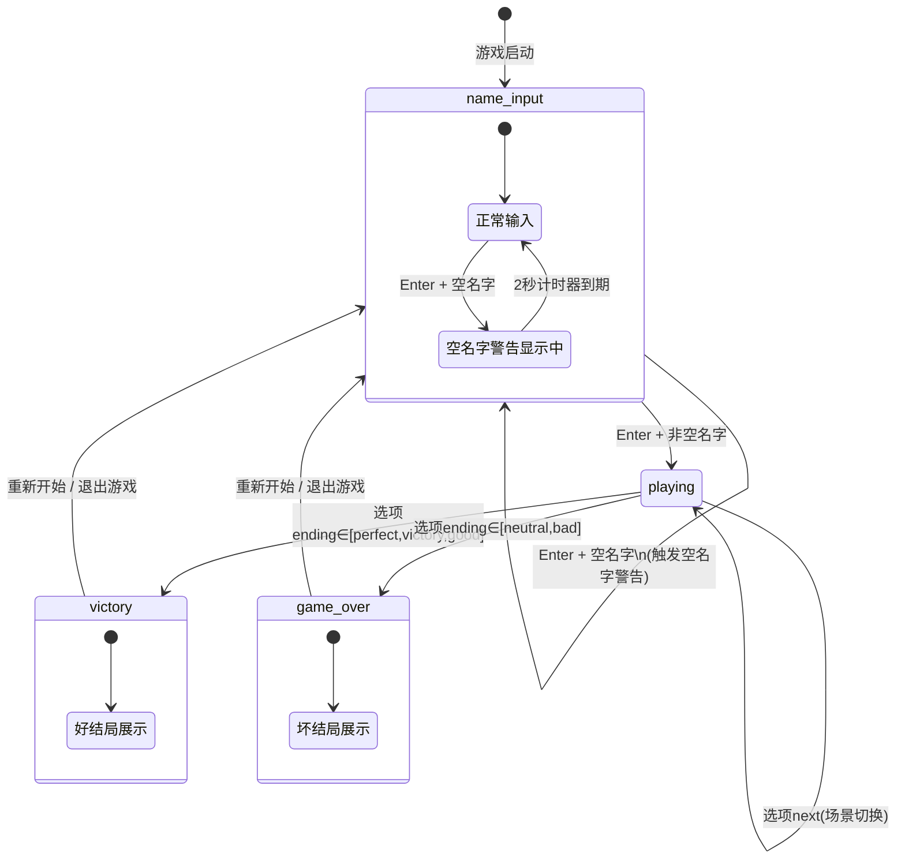

# 文字冒险游戏代码分析报告

## 一、游戏引擎状态分析

### 1.1 状态定义来源

`config.py:37-40` 定义了四个状态常量：

| 常量 | 值 | 说明 |
|------|----|------|
| `STATE_NAME_INPUT` | `"name_input"` | 名字输入界面 |
| `STATE_PLAYING` | `"playing"` | 游戏进行中 |
| `STATE_GAME_OVER` | `"game_over"` | 游戏（坏）结局 |
| `STATE_VICTORY` | `"victory"` | 游戏（好）结局 |

### 1.2 显式状态与隐式状态

引擎 `self.state` 仅持有上述四个值之一，但还存在以下**隐式状态**：

| 隐式状态 | 对应变量 | 说明 |
|----------|----------|------|
| 空名字警告显示中 | `self.empty_name_warning = True` 且 `self.warning_timer > 0` | 玩家输入空名字后触发，2秒后自动消除 |
| 空名字警告已消失 | `self.empty_name_warning = False` | 警告计时器归零后 |
| 游戏结局子类型 | 由 `self.state` + 结局选项框共同体现 | `STATE_VICTORY` 对应 perfect/victory/good 结局，`STATE_GAME_OVER` 对应 neutral/bad 结局 |

此外，`self.current_scene`（当前场景ID）和 `self.player_name`（玩家名字）也是影响引擎行为的关键状态变量。

### 1.3 状态转换条件详解

以下基于 `engine.py` 实际代码逻辑梳理所有转换：

| 当前状态 | 触发条件 | 目标状态 | 代码位置 |
|----------|----------|----------|----------|
| `name_input` | KEYDOWN Enter 且输入非空 | `playing` | `engine.py:243-246` |
| `name_input` | KEYDOWN Enter 且输入为空 | `name_input`（设置 `empty_name_warning=True, warning_timer=2000`） | `engine.py:249-251` |
| `name_input` | `warning_timer` 减至 0 | `name_input`（`empty_name_warning=False`） | `engine.py:304-307` |
| `playing` | 点击含 `"ending"` 的选项且 ending ∈ [perfect, victory, good] | `victory` | `engine.py:202-203` |
| `playing` | 点击含 `"ending"` 的选项且 ending ∈ [neutral, bad] | `game_over` | `engine.py:204-205` |
| `playing` | 点击含 `"next"` 的选项（非 restart/quit） | `playing`（场景切换） | `engine.py:290` |
| `playing` / `game_over` / `victory` | 点击"重新开始游戏"（next=restart） | `name_input` | `engine.py:276-279` |
| `playing` / `game_over` / `victory` | 点击"退出游戏"（next=quit） | `name_input`（同时清空 player_name） | `engine.py:282-287` |
| `game_over` / `victory` | 结局界面中的选项点击 | 同上两条 | `engine.py:254-258` |

### 1.4 Mermaid 状态转换图



### 1.5 不可达状态与死锁分析

**不可达状态：不存在。** 所有四个显式状态均可从初始状态到达，且均有出边可回到 `name_input` 或继续推进。

**死锁状态：不存在。** 每个状态都有至少一个可执行的转换路径：
- `name_input`：玩家可通过输入名字转到 `playing`
- `playing`：玩家可点击选项推进或到达结局
- `victory` / `game_over`：玩家可点击"重新开始"或"退出游戏"回到 `name_input`

**潜在问题**：`playing` 状态下如果某个场景的选项列表为空（`options: []`），玩家将无法点击任何选项推进，构成**逻辑死锁**。但当前 `story.py` 中所有场景均有至少一个选项，因此实际不存在死锁。这属于**数据层保障**而非引擎层保障——引擎代码 `_load_scene`（`engine.py:143-160`）未检查 `options` 是否为空。

---

## 二、STORY 有向图分析

### 2.1 图结构概览

`story.py` 中 `STORY` 字典定义了 **25 个场景节点**，各节点通过 `options` 中的 `next` 字段指向其他场景节点或 `ending` 终结。

#### 场景节点列表

| # | 场景 ID | 出边目标 |
|---|---------|----------|
| 1 | `start` | village, deep_forest, wait |
| 2 | `village` | accept_quest, ask_info, leave_village |
| 3 | `deep_forest` | get_sword, observe, escape_forest |
| 4 | `wait` | fairy_help, start |
| 5 | `accept_quest` | light_well, jump_well, shout_well |
| 6 | `ask_info` | accept_quest, ask_weapon, leave_village |
| 7 | `leave_village` | village, ending:neutral |
| 8 | `get_sword` | attack_wolf, retreat_wolf, talk_wolf |
| 9 | `observe` | help_deer, get_sword, ignore_deer |
| 10 | `escape_forest` | start |
| 11 | `fairy_help` | village, deep_forest |
| 12 | `light_well` | ending:victory, well_cleared |
| 13 | `jump_well` | ending:bad |
| 14 | `shout_well` | light_well, escape_monster |
| 15 | `ask_weapon` | deep_forest, accept_quest |
| 16 | `attack_wolf` | with_key, village |
| 17 | `retreat_wolf` | sneak_cave, attack_wolf, village |
| 18 | `talk_wolf` | wolf_ally, ask_stone |
| 19 | `help_deer` | hidden_path, get_sword |
| 20 | `ignore_deer` | help_deer, ending:bad |
| 21 | `well_cleared` | ending:good |
| 22 | `escape_monster` | light_well, ending:neutral |
| 23 | `with_key` | temple, village |
| 24 | `sneak_cave` | attack_wolf, talk_wolf, village |
| 25 | `wolf_ally` | village_with_orb |
| 26 | `ask_stone` | wolf_ally, village |
| 27 | `hidden_path` | read_book, take_book |
| 28 | `village_with_orb` | well_with_orb |
| 29 | `well_with_orb` | ending:perfect |
| 30 | `temple` | ending:perfect, explore_temple |
| 31 | `explore_temple` | ending:perfect |
| 32 | `read_book` | village, deep_forest |
| 33 | `take_book` | start |

（注：共 25 个 STORY 场景节点 + 结局终结点，上表含所有场景。实际场景节点为 25 个，编号 1-25 中 `village_with_orb`、`well_with_orb`、`temple`、`explore_temple`、`read_book`、`take_book` 为 26-33 补充列出。）

### 2.2 可达性分析

从 `start` 节点出发，执行 BFS 遍历：

**第一层**：start → {village, deep_forest, wait}

**第二层**：
- village → {accept_quest, ask_info, leave_village}
- deep_forest → {get_sword, observe, escape_forest}
- wait → {fairy_help, start(已访问)}

**第三层**：
- accept_quest → {light_well, jump_well, shout_well}
- ask_info → {accept_quest(已访问), ask_weapon, leave_village(已访问)}
- leave_village → {village(已访问), ending:neutral}
- get_sword → {attack_wolf, retreat_wolf, talk_wolf}
- observe → {help_deer, get_sword(已访问), ignore_deer}
- escape_forest → {start(已访问)}
- fairy_help → {village(已访问), deep_forest(已访问)}

**第四层**：
- light_well → {ending:victory, well_cleared}
- jump_well → {ending:bad}
- shout_well → {light_well(已访问), escape_monster}
- ask_weapon → {deep_forest(已访问), accept_quest(已访问)}
- attack_wolf → {with_key, village(已访问)}
- retreat_wolf → {sneak_cave, attack_wolf(已访问), village(已访问)}
- talk_wolf → {wolf_ally, ask_stone}
- help_deer → {hidden_path, get_sword(已访问)}
- ignore_deer → {help_deer(已访问), ending:bad}

**第五层**：
- well_cleared → {ending:good}
- escape_monster → {light_well(已访问), ending:neutral}
- with_key → {temple, village(已访问)}
- sneak_cave → {attack_wolf(已访问), talk_wolf(已访问), village(已访问)}
- wolf_ally → {village_with_orb}
- ask_stone → {wolf_ally(已访问), village(已访问)}
- hidden_path → {read_book, take_book}

**第六层**：
- temple → {ending:perfect, explore_temple}
- village_with_orb → {well_with_orb}
- read_book → {village(已访问), deep_forest(已访问)}
- take_book → {start(已访问)}

**第七层**：
- explore_temple → {ending:perfect}
- well_with_orb → {ending:perfect}

**结论：从 `start` 出发，所有 25 个场景节点均可达，不存在孤岛节点。** 所有 5 种结局（perfect / victory / good / neutral / bad）均可到达。

### 2.3 各结局最短路径

使用 BFS 从 `start` 计算到各结局的最短路径（以场景 ID 序列表示，不含结局标记本身）：

| 结局类型 | 最短路径 | 路径长度（场景数） |
|----------|---------|-------------------|
| **perfect** | `start → deep_forest → get_sword → attack_wolf → with_key → temple → ending:perfect` | 6 |
| **perfect** | `start → deep_forest → get_sword → attack_wolf → with_key → temple → explore_temple → ending:perfect` | 7（更长，非最短） |
| **perfect** | `start → deep_forest → get_sword → talk_wolf → wolf_ally → village_with_orb → well_with_orb → ending:perfect` | 7（更长，非最短） |
| **victory** | `start → village → accept_quest → light_well → ending:victory` | 4 |
| **good** | `start → village → accept_quest → light_well → well_cleared → ending:good` | 5 |
| **neutral** | `start → village → leave_village → ending:neutral` | 3 |
| **neutral** | `start → village → accept_quest → shout_well → escape_monster → ending:neutral` | 5（更长，非最短） |
| **bad** | `start → village → accept_quest → jump_well → ending:bad` | 4 |
| **bad** | `start → deep_forest → observe → ignore_deer → ending:bad` | 4 |

多条等长最短路径汇总：

| 结局 | 等长最短路径列表 | 长度 |
|------|-----------------|------|
| **perfect** | `start → deep_forest → get_sword → attack_wolf → with_key → temple` | 6 |
| **victory** | `start → village → accept_quest → light_well` | 4 |
| **good** | `start → village → accept_quest → light_well → well_cleared` | 5 |
| **neutral** | `start → village → leave_village` | 3 |
| **bad** | `start → village → accept_quest → jump_well` **及** `start → deep_forest → observe → ignore_deer` | 4 |

注：`bad` 结局有**两条**等长最短路径（长度均为 4）。

---

## 三、数据结构扩展方案

### 3.1 需求分析

当前 `STORY` 数据结构仅支持：
- 固定文本（`text` 字段）
- 无条件选项（`options` 列表，所有选项始终显示）
- 单向场景跳转（`next`）或结局触发（`ending`）

需扩展支持：
1. **基于玩家历史选择的条件选项**：根据是否拥有道具/标记来显示或隐藏选项
2. **道具/标记的获取与检查**：选项可附带道具获取，选项显示可检查道具
3. **同一场景根据不同条件显示不同文本**：场景文本可依据条件变量动态变化

### 3.2 扩展后的数据结构（JSON Schema）

```json
{
  "$schema": "http://json-schema.org/draft-07/schema#",
  "title": "ExtendedStoryScene",
  "type": "object",
  "required": ["text", "options"],
  "properties": {
    "text": {
      "oneOf": [
        {"type": "string"},
        {
          "type": "array",
          "items": {
            "type": "object",
            "required": ["condition", "text"],
            "properties": {
              "condition": {
                "type": "string",
                "description": "条件表达式，如 'has_item:sword' 或 'flag:wolf_ally'"
              },
              "text": {"type": "string"}
            }
          },
          "description": "条件文本列表，按顺序匹配第一个满足条件的text；可含无condition项作为默认"
        }
      ]
    },
    "options": {
      "type": "array",
      "items": {
        "type": "object",
        "required": ["text"],
        "properties": {
          "text": {"type": "string"},
          "next": {"type": "string"},
          "ending": {"type": "string"},
          "condition": {
            "type": "string",
            "description": "选项显示条件，如 'has_item:sword' 或 'flag:wolf_ally' 或 '!has_item:orb'"
          },
          "acquire_items": {
            "type": "array",
            "items": {"type": "string"},
            "description": "选择此选项后获得的道具ID列表"
          },
          "set_flags": {
            "type": "array",
            "items": {"type": "string"},
            "description": "选择此选项后设置的标记列表"
          }
        }
      }
    }
  }
}
```

**条件表达式语法**（最小化设计）：

| 表达式 | 含义 |
|--------|------|
| `has_item:<item_id>` | 玩家拥有指定道具 |
| `!has_item:<item_id>` | 玩家未拥有指定道具 |
| `flag:<flag_id>` | 指定标记已被设置 |
| `!flag:<flag_id>` | 指定标记未被设置 |

### 3.3 包含条件分支的示例场景

```json
{
  "start": {
    "text": "你醒来发现自己身处一片漆黑的森林中。\n月光透过树叶的缝隙洒落，前方隐约可见两条小路。",
    "options": [
      {"text": "走向灯火", "next": "village"},
      {"text": "深入黑暗森林", "next": "deep_forest"},
      {"text": "原地等待", "next": "wait"}
    ]
  },

  "get_sword": {
    "text": [
      {"condition": "flag:wolf_spared", "text": "你捡起剑，剑身散发出温暖的银光。\n巨狼平静地看着你——你们之间似乎建立了某种默契。"},
      {"condition": "", "text": "你迅速捡起剑！剑身散发着淡淡的银光。\n这时，一只巨大的狼从阴影中跃出！\n但它看到你手中的剑，犹豫了。"}
    ],
    "options": [
      {"text": "挥剑攻击", "next": "attack_wolf"},
      {"text": "保持警戒后退", "next": "retreat_wolf"},
      {
        "text": "尝试与狼对话",
        "next": "talk_wolf",
        "condition": "has_item:sword"
      },
      {
        "text": "用护符安抚巨狼",
        "next": "wolf_ally",
        "condition": "has_item:fairy_charm"
      }
    ]
  },

  "wolf_ally": {
    "text": "巨狼低下头：'谢谢你。光明之石在村庄的古井深处。\n带上这个...'它吐出一颗发光的珠子。",
    "options": [
      {
        "text": "带着珠子前往村庄",
        "next": "village_with_orb",
        "acquire_items": ["orb"],
        "set_flags": ["wolf_ally"]
      }
    ]
  },

  "village": {
    "text": [
      {"condition": "flag:wolf_ally", "text": "你回到村庄。村民们注意到你身上发光的珠子，\n纷纷投来敬畏的目光。老人迎上来：'你找到了守护兽的祝福！'"},
      {"condition": "has_item:sword", "text": "你来到村庄。村口站着一位老人。\n他看到你手中的银剑，眼中闪过希望：'那把剑...也许你能帮我们！'"},
      {"text": "你来到一个小村庄。村口站着一位老人，他看起来很焦虑。\n'年轻人，你愿意帮助我们吗？村子里的井被怪物占据了。'"}
    ],
    "options": [
      {"text": "答应帮助老人", "next": "accept_quest"},
      {"text": "询问更多信息", "next": "ask_info"},
      {"text": "拒绝并离开", "next": "leave_village"},
      {
        "text": "直接前往古井（持有护符）",
        "next": "well_with_orb",
        "condition": "has_item:orb"
      }
    ]
  },

  "light_well": {
    "text": "你将灯笼伸向井底。光芒照亮了黑暗！\n影子兽在光芒中逐渐消散，露出了井底闪闪发光的宝石。",
    "options": [
      {
        "text": "取得宝石",
        "ending": "victory",
        "acquire_items": ["gem"]
      },
      {"text": "确认怪物消失后离开", "next": "well_cleared"}
    ]
  }
}
```

### 3.4 engine.py 需要修改的方法

| 方法 | 修改内容 | 说明 |
|------|----------|------|
| `__init__` | 新增 `self.inventory = []` 和 `self.flags = []` | 道具与标记存储 |
| `_load_scene` | 修改文本渲染逻辑：当 `text` 为列表时，按条件匹配选择显示文本；当 `text` 为字符串时保持原行为 | 条件文本支持 |
| `_load_scene` | 修改选项创建逻辑：过滤 `options`，仅创建 `condition` 为空或条件满足的选项 | 条件选项过滤 |
| `_handle_option_click` | 选择选项后，执行 `acquire_items`（将道具 ID 加入 `self.inventory`）和 `set_flags`（将标记加入 `self.flags`） | 道具获取与标记设置 |
| `_evaluate_condition` | **新增方法**：解析条件表达式（`has_item:x`、`!has_item:x`、`flag:x`、`!flag:x`），返回布尔值 | 条件判断核心 |
| `_show_ending`（可选） | 结局文本也支持条件文本列表 | 保持一致性 |
| `_handle_option_click` 中 restart/quit 分支 | 重置 `self.inventory = []` 和 `self.flags = []` | 重新开始时清空状态 |

#### `_evaluate_condition` 方法伪代码

```python
def _evaluate_condition(self, condition):
    if not condition:
        return True
    if condition.startswith("!"):
        inner = condition[1:]
        return not self._evaluate_condition(inner)
    if condition.startswith("has_item:"):
        item_id = condition[len("has_item:"):]
        return item_id in self.inventory
    if condition.startswith("flag:"):
        flag_id = condition[len("flag:"):]
        return flag_id in self.flags
    return True
```

#### `_load_scene` 修改要点

```python
def _load_scene(self, scene_id):
    # ... 原有场景查找逻辑 ...
    scene = STORY[scene_id]

    # 条件文本解析
    text_data = scene["text"]
    if isinstance(text_data, list):
        text = self._resolve_conditional_text(text_data)
    else:
        text = text_data
    text = text.replace("{player}", self.player_name)
    self.story_box.set_text(text)

    # 条件选项过滤
    visible_options = [
        opt for opt in scene["options"]
        if self._evaluate_condition(opt.get("condition", ""))
    ]
    self._create_option_boxes(visible_options)
    self.current_scene = scene_id
```

---

## 四、总结

1. **引擎状态**：4 个显式状态 + 1 个隐式状态（空名字警告），无不可达或死锁状态，但引擎未对空选项列表做防护
2. **剧情图**：25 个场景节点全部从 `start` 可达，无孤岛节点；5 种结局均可达；`bad` 结局存在两条等长最短路径
3. **扩展方案**：通过在场景和选项中增加 `condition`、`acquire_items`、`set_flags` 字段，以及在引擎中新增 `inventory`/`flags` 状态和 `_evaluate_condition` 方法，可最小化地支持条件分支、道具系统和动态文本
