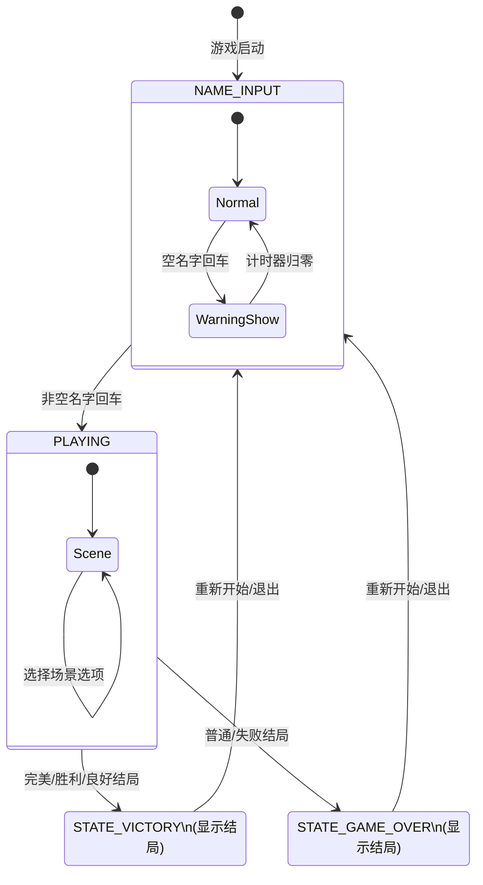

# 文字冒险游戏代码分析报告

## 一、游戏引擎状态分析

### 1.1 状态列表

#### 显式状态（config.py 中定义）

| 状态常量 | 状态值 | 说明 |
|---------|--------|------|
| `STATE_NAME_INPUT` | `name_input` | 玩家名字输入界面 |
| `STATE_PLAYING` | `playing` | 游戏进行中，显示场景和选项 |
| `STATE_GAME_OVER` | `game_over` | 游戏结束（bad/neutral 结局） |
| `STATE_VICTORY` | `victory` | 游戏胜利（perfect/victory/good 结局） |

#### 隐式状态（engine.py 中实现）

| 状态变量 | 类型 | 说明 |
|---------|------|------|
| `empty_name_warning` | `bool` | 空名字警告显示中 |
| `warning_timer` | `int` | 警告显示计时器（毫秒） |

### 1.2 状态转换条件

| 起始状态 | 目标状态 | 转换条件 | 触发位置 |
|---------|---------|---------|---------|
| `NAME_INPUT` | `PLAYING` | 玩家输入非空名字并按下 Enter 键 | engine.py:242-246 |
| `NAME_INPUT` | `NAME_INPUT` | 玩家输入空名字并按下 Enter（显示警告） | engine.py:247-250 |
| `NAME_INPUT (警告中)` | `NAME_INPUT` | `warning_timer` 减至 0（警告消失） | engine.py:304-307 |
| `PLAYING` | `GAME_OVER` | 选择 bad/neutral 结局选项 | engine.py:202-205 |
| `PLAYING` | `VICTORY` | 选择 perfect/victory/good 结局选项 | engine.py:202-204 |
| `GAME_OVER` | `NAME_INPUT` | 点击「重新开始游戏」或「退出游戏」 | engine.py:274-287 |
| `VICTORY` | `NAME_INPUT` | 点击「重新开始游戏」或「退出游戏」 | engine.py:274-287 |
| `PLAYING` | `PLAYING` | 选择非结局选项，加载下一个场景 | engine.py:289-290 |

### 1.3 状态转换图（Mermaid）



### 1.4 不可达状态与死锁分析

**结论：不存在不可达状态，也不存在死锁状态。**

- 所有显式状态（NAME_INPUT、PLAYING、GAME_OVER、VICTORY）均可从起始状态到达
- 所有状态均有退出路径：
  - NAME_INPUT → PLAYING（输入名字）
  - PLAYING → VICTORY / GAME_OVER（选择结局）
  - VICTORY / GAME_OVER → NAME_INPUT（重新开始）
- 隐式状态（空名字警告）可自动回归 Normal 状态，无死锁

---

## 二、故事有向图分析

### 2.1 基本信息

- **总场景节点数**：33 个
- **总结局类型**：5 种（perfect/victory/good/neutral/bad）

### 2.2 可达性分析

**结论：从 `start` 节点出发，所有 33 个场景节点均可达，不存在孤岛节点。**

| 统计项 | 数值 |
|-------|------|
| 总场景数 | 33 |
| 可达场景数 | 33 |
| 孤岛场景数 | 0 |

### 2.3 最短路径表（从 start 到各结局）

#### 最短路径汇总

| 结局类型 | 最短步数 | 路径数量 |
|---------|---------|---------|
| perfect | 6 步 | 1 条 |
| victory | 4 步 | 1 条 |
| good | 5 步 | 1 条 |
| neutral | 3 步 | 1 条 |
| bad | 4 步 | 2 条 |

#### 各结局最短路径详情

**完美结局（perfect）- 6 步**

| 路径序号 | 场景序列 |
|---------|---------|
| 1 | start → deep_forest → get_sword → attack_wolf → with_key → temple → ending:perfect |

**胜利结局（victory）- 4 步**

| 路径序号 | 场景序列 |
|---------|---------|
| 1 | start → village → accept_quest → light_well → ending:victory |

**良好结局（good）- 5 步**

| 路径序号 | 场景序列 |
|---------|---------|
| 1 | start → village → accept_quest → light_well → well_cleared → ending:good |

**普通结局（neutral）- 3 步**

| 路径序号 | 场景序列 |
|---------|---------|
| 1 | start → village → leave_village → ending:neutral |

**失败结局（bad）- 4 步**

| 路径序号 | 场景序列 |
|---------|---------|
| 1 | start → village → accept_quest → jump_well → ending:bad |
| 2 | start → deep_forest → observe → ignore_deer → ending:bad |

---

## 三、数据结构扩展方案设计

### 3.1 扩展目标

支持以下新功能：
1. 基于玩家历史选择的条件选项显示/隐藏
2. 道具/标记的获取与检查
3. 同一场景根据不同条件显示不同文本

### 3.2 扩展后的数据结构（JSON Schema）

```json
{
  "$schema": "http://json-schema.org/draft-07/schema#",
  "title": "游戏剧情扩展数据结构",
  "type": "object",
  "properties": {
    "STORY": {
      "type": "object",
      "additionalProperties": {
        "$ref": "#/definitions/Scene"
      }
    },
    "ENDINGS": {
      "type": "object",
      "additionalProperties": {
        "$ref": "#/definitions/Ending"
      }
    }
  },
  "definitions": {
    "Scene": {
      "type": "object",
      "properties": {
        "text": {
          "oneOf": [
            { "type": "string" },
            {
              "type": "array",
              "items": {
                "type": "object",
                "properties": {
                  "condition": { "$ref": "#/definitions/Condition" },
                  "text": { "type": "string" }
                },
                "required": ["condition", "text"]
              }
            }
          ],
          "description": "固定文本或条件文本列表"
        },
        "options": {
          "type": "array",
          "items": { "$ref": "#/definitions/Option" }
        },
        "on_enter": {
          "type": "array",
          "items": { "$ref": "#/definitions/Action" },
          "description": "进入场景时自动执行的动作"
        }
      },
      "required": ["text", "options"]
    },
    "Option": {
      "type": "object",
      "properties": {
        "text": { "type": "string" },
        "next": { "type": "string" },
        "ending": { "type": "string" },
        "show_condition": { "$ref": "#/definitions/Condition" },
        "hide_condition": { "$ref": "#/definitions/Condition" },
        "actions": {
          "type": "array",
          "items": { "$ref": "#/definitions/Action" },
          "description": "选择此选项时执行的动作"
        }
      },
      "oneOf": [
        { "required": ["text", "next"] },
        { "required": ["text", "ending"] }
      ]
    },
    "Condition": {
      "type": "object",
      "properties": {
        "op": {
          "type": "string",
          "enum": ["and", "or", "not", "has_flag", "has_item", "scene_visited", "choice_made", "eq", "gt", "lt"]
        },
        "args": {
          "type": "array",
          "items": {
            "oneOf": [
              { "type": "string" },
              { "type": "number" },
              { "type": "boolean" },
              { "$ref": "#/definitions/Condition" }
            ]
          }
        }
      },
      "required": ["op", "args"]
    },
    "Action": {
      "type": "object",
      "properties": {
        "type": {
          "type": "string",
          "enum": ["set_flag", "clear_flag", "add_item", "remove_item", "set_var"]
        },
        "target": { "type": "string" },
        "value": {
          "oneOf": [
            { "type": "string" },
            { "type": "number" },
            { "type": "boolean" }
          ]
        }
      },
      "required": ["type", "target"]
    },
    "Ending": {
      "type": "object",
      "properties": {
        "title": { "type": "string" },
        "text": { "type": "string" }
      },
      "required": ["title", "text"]
    }
  }
}
```

### 3.3 条件表达式说明

| 操作符 | 参数 | 说明 |
|-------|------|------|
| `and` | [Condition, Condition, ...] | 逻辑与 |
| `or` | [Condition, Condition, ...] | 逻辑或 |
| `not` | [Condition] | 逻辑非 |
| `has_flag` | [flag_name] | 检查是否有标记 |
| `has_item` | [item_name] | 检查是否有道具 |
| `scene_visited` | [scene_id] | 检查是否访问过场景 |
| `choice_made` | [scene_id, option_index] | 检查是否做过某个选择 |
| `eq` | [var_name, value] | 变量等于值 |
| `gt` | [var_name, value] | 变量大于值 |
| `lt` | [var_name, value] | 变量小于值 |

### 3.4 示例场景（包含条件分支）

```python
STORY = {
    "forest_entrance": {
        "text": [
            {
                "condition": {"op": "has_item", "args": ["silver_sword"]},
                "text": "你手握银剑，信心满满地站在森林入口。"
            },
            {
                "condition": {"op": "has_flag", "args": ["talked_to_wolf"]},
                "text": "你想起了与巨狼的对话，森林似乎不再那么可怕。"
            },
            {
                "condition": {"op": "and", "args": [
                    {"op": "scene_visited", "args": ["village"]},
                    {"op": "not", "args": [{"op": "has_item", "args": ["lantern"]}]}
                ]},
                "text": "你还没有拿到灯笼，黑暗的森林让你有些不安。"
            },
            {
                "condition": {"op": "eq", "args": ["truth_value", True]},
                "text": "你站在黑暗森林的入口。"
            }
        ],
        "options": [
            {
                "text": "向村庄出发",
                "next": "village"
            },
            {
                "text": "进入森林深处",
                "next": "deep_forest",
                "show_condition": {"op": "has_item", "args": ["lantern"]},
                "actions": [
                    {"type": "set_flag", "target": "entered_forest_night"}
                ]
            },
            {
                "text": "与巨狼一起进入（需要巨狼盟友）",
                "next": "wolf_forest",
                "show_condition": {"op": "has_flag", "args": ["wolf_ally"]},
                "hide_condition": {"op": "has_item", "args": ["silver_sword"]}
            }
        ],
        "on_enter": [
            {"type": "set_var", "target": "visit_count_forest", "value": 1}
        ]
    }
}
```

### 3.5 engine.py 需要修改的方法

| 方法名 | 修改内容 | 位置 |
|-------|---------|------|
| `__init__` | 新增玩家状态存储：`self.flags`, `self.items`, `self.vars`, `self.visited_scenes`, `self.choices_made` | engine.py:33-57 |
| `_load_scene` | 1. 记录场景访问历史<br>2. 支持条件文本渲染（根据条件选择匹配的 text）<br>3. 执行 `on_enter` 动作 | engine.py:143-160 |
| `_create_option_boxes` | 增加条件过滤逻辑（检查 `show_condition` / `hide_condition`，只显示满足条件的选项） | engine.py:120-141 |
| `_handle_option_click` | 执行选项的 `actions`（设置标记、添加道具等）<br>记录玩家的选择历史 | engine.py:260-290 |
| 新增 `_evaluate_condition` | 递归求值条件表达式，支持所有条件操作符 | 新增方法 |
| 新增 `_execute_actions` | 执行动作列表（设置/清除标记、添加/移除道具、设置变量） | 新增方法 |
| 新增 `_resolve_text` | 根据当前状态解析条件文本，选择最合适的显示文本 | 新增方法 |

### 3.6 核心新增方法伪代码

```python
def _evaluate_condition(self, condition):
    """递归求值条件表达式"""
    op = condition["op"]
    args = condition["args"]
    
    if op == "and":
        return all(self._evaluate_condition(c) for c in args)
    elif op == "or":
        return any(self._evaluate_condition(c) for c in args)
    elif op == "not":
        return not self._evaluate_condition(args[0])
    elif op == "has_flag":
        return args[0] in self.flags
    elif op == "has_item":
        return args[0] in self.items
    elif op == "scene_visited":
        return args[0] in self.visited_scenes
    elif op == "eq":
        return self.vars.get(args[0]) == args[1]
    # ... 其他操作符

def _execute_actions(self, actions):
    """执行动作列表"""
    for action in actions:
        action_type = action["type"]
        target = action["target"]
        value = action.get("value", True)
        
        if action_type == "set_flag":
            self.flags.add(target)
        elif action_type == "clear_flag":
            self.flags.discard(target)
        elif action_type == "add_item":
            self.items.add(target)
        elif action_type == "remove_item":
            self.items.discard(target)
        elif action_type == "set_var":
            self.vars[target] = value

def _resolve_text(self, text_config):
    """解析条件文本，返回第一个匹配的文本"""
    if isinstance(text_config, str):
        return text_config.replace("{player}", self.player_name)
    
    for item in text_config:
        if self._evaluate_condition(item["condition"]):
            return item["text"].replace("{player}", self.player_name)
    
    return ""
```
